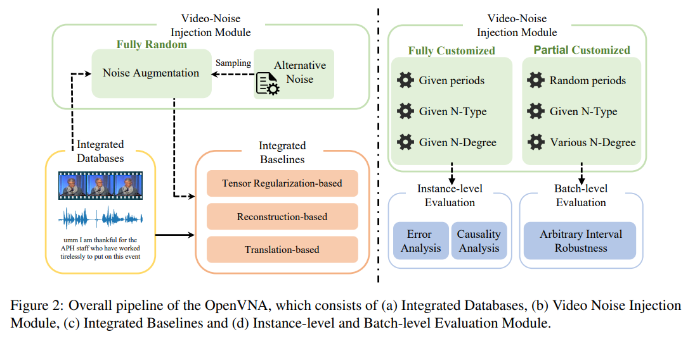

## OpenVNA: An Open-source Framework for Video Noise Analysis

> - OpenVNA is an open-source framework for injecting customized video noise and evaluating model robustness.
>
> - The crux of the designed framework lies in the viable and flexible noise injection module, which encompasses over ten categories of audio and visual noise variations at both feature and raw video levels.
>
> - The Framework incorporates a modular pipeline that facilitates video noise based augmentation and effortless model evaluation, encompassing both instance-level editable video noise effect analysis and batch-level quantitative assessments.



## Model Training and Quantitative Evaluation Pipeline.

1. For MOSI，MOSEI，SIMSv2 and MIntRec feature datasets, you need to download them Using the following link,(unaligned_v171_a25_l50.pkl). In addition, the link contains files such as background noise.

   [BaiduYun Disk](https://pan.baidu.com/s/1luI1yJaJr5e8fh6q_mJ_rQ?pwd=zzx1 ) `code: zzx1`

   [Google Drive](https://drive.google.com/drive/folders/1Qa8Bgxcss4c7UgxiTQXC0J8mruP7kTqN?usp=drive_link)

2. Using the following script to run our codes.

   2.1 Performing <selected_model> on <selected_database> dataset with feature level noise-based augmentation. 

   Constructing Feature Level Noisy Augmentation using `feat_noise_cons.py`. The Generated Noisy Databases will be saved at `NOISY_DATASET_ROOT_DIR/DATABASE/NOISETYPE/noisy_feature_INTENSITY_SEED.pkl`

   ```python
   python feat_noise_cons.py --dataset <selected_database> --injected-noise <selected_noise_type> --noise-intensity <selected_intensity> --inject-noise-seed <selected_seed>
   ```

   2.2 Performing <noise_type> on <video_path> raw dataset with raw-video level noise-based augmentation. 

   Constructing Feature Level Noisy Augmentation using `real_noise_cons.py`. The Generated Noisy Databases will be saved at <save_dir>. 

   ```python
   python real_noise_cons.py  --video-dir <video_path> --noise-type <noise_type> --save-dir <save_dir>
   ```

   2.3 During the training phase, Performing <selected_model> on <selected_database> dataset with default configurations w.o Augmentation.

   ```python 
   python main.py --model <selected_model> --dataset <selected_database>
   ```

   > Note: For models which utilize paired perfect and noisy instances (TFR-Net, NIAT, and EMT-DLFR), noise-based augmentations is required. Taking TFRNet for example.

   ```python
   python main.py --model TFRNet --augmentation feat_random_drop --dataset  <selected_database>
   ```

   2.4 During the test phase, Performing <selected_model> on <selected_database> dataset, and  <model_save_dir>  is the saved model path.

   ```python
   python test.py --model <selected_model> --dataset <selected_database> --model-save-dir <model_save_dir>
   ```

   